# Challenges and novel solution for wide-area protection due to renewable sources integration into smart grid: an extensive review  

M. 
M. Eissa1  
1Electrical Engineering Department, Faculty of Engineering at Helwan, Helwan University, Egypt  
2E-mail: mmmeissa@hotmail.com  

Abstract: Wide- area protection and control (WAPAC) is a new technology in the smart grid system. The high penetration of wind farms in power systems is likely to have an adverse impact on the relay operation even if the short- circuit current in such systems decays rapidly due to crowbar resistance. By including various renewable sources, and information and communication technology components, the power grid will become more complex. Approaches based on wide- area monitoring system (WAMS) are developed to solve the current challenges of the future of high renewable resources penetration. This study provides the latest main components of the WAMS architecture and the innovation in WAPAC research development using phasor measurement units (PMUs). As the extensive article review in this area is given that show no solution until now for wide- area protection in case of high wind farm penetration. A new wide- area protection based on PMUs is deployed. The main concept is based on describing by differential equations the dynamic operation of the transmission lines. In case of faults, the equations become non- linear and become difficult to be solved. This is the first time to develop such an idea to identify the protected faulted zone and guarantees sustainability for the power flow.  

## 1 Introduction  

The most important device in the wide- area protection and control (WAPAC) is the phasor measurement unit (PMU). PMU's are deployed at various locations in the smart grid to provide real- time monitoring for measuring the voltage, current, angle, frequency etc. PMU's are used for protection and monitoring purposes. Wide- area monitoring system (WAMS) uses device sensors deployed everywhere on the grid in combination with global positioning system (GPS) satellites for accurate time stamping of measurements. The incorporated sensors will interact with the communication media. The most essential elements in the smart grid are the PMU's.  

The information and communication technology (ICT) is an extended term for information technology (IT) that highly applied now in smart grid to utilise and gather data information about the conduct of suppliers and consumers, in digital method to ameliorate, and enhance the efficiency, economics and sustainability of the electricity. The smart grid considers the integration of electrical and communication infrastructures with advanced process automation and information technologies within the existing electrical network. A complete way of changes has occurred in the utilities, politicians, customers and other industry participants based on the smart grid system about electricity delivery and its related services.  

This new thinking leads to various smart grid technologies and solutions. It is a great benefit that helps in integration of utility engineering and operations with a new business model. Renewable energy sources have the potential to play a large role in respect of energy sustainability in the future. By including various renewable sources, and ICT components, the power grid will become more complex, see Fig. 1. The renewable energy sources get the power grid more unpredictable.  

The ICT components are a part of the smart grid infrastructure. The two ways of flow of electricity and information are depicted in [2]. The concept of two way flow of information is unpretentious and understandable. The process of electricity nowadays becomes bidirectional.  

## 2 Wind turbines challenges in protection  

The wind turbines can feed currents during the short circuit such as the traditional generators that affect the protection settings. The wind turbines can be classified into four types based on the size and speed as being fixed or variable. Also, it can be classified according to the converter infrastructure with the generator [3]. Traditionally, the fixed speed wind turbines were the common, but nowadays the most popular is the variable speed wind turbines. Such type has a wide range of shaft speed and can extract power at low speed and consequently increase the energy production [4]. This section will survey briefly the four types of the wind fault performance. The first type (A) is the fixed speed wind turbine equipped with squirrel cage induction generators directly connected to the grid via a step- up transformer, as shown in Fig. 2a. The short- circuit current of this type is determined by the generator dynamics and the high short circuit can be delivered and decaying according to the fluxes present in the stator and rotor [3].  

The second \(B\) type (Fig. 2b) is the limited variable speed wind turbine. The turbine uses a wound rotor induction generator and an external resistance with the rotor. The short- circuit current in the stator decays rapidly because of the high external rotor resistance. Consequently, the AC component of the stator current decays also rapidly. The fault current looks like the current in the doubly fed induction generator (DFIG) [3].  

The third type is known as the type \(C\) with variable speed DFIG. The generator stator is directly connected to the grid. The same for the rotor that is connected to the grid, but through a back- to- back converter. Two or three winding step- up transformers can be used, see Fig. 2c. RSC is the rotor- side converter and AGSC is the grid- side converter [5]. During the short circuit, a high stator and rotor currents are induced in the DFIG. The short- circuit current magnitude mainly depends on the crowbar and DC chopper. The short- circuit current in the DFIG decays rapidly due to the high crowbar resistance. The predominance of DC component after many cycles can be found in the DFIG. In most cases, the short- circuit current can be limited to the nominal value by the crowbar resistance and the converter circuit.  

The last type is \(D\) , see Fig. 2d. The wind turbine can be connected to the grid through full scale back- to- back converter

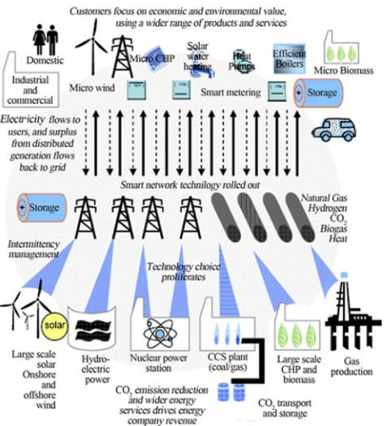

Fig. 1 Renewable sources penetration on the future smart grid [1] 
  

(FSC). The generator can be a synchronous or induction type. The short- circuit current can be limited by the FSC to the nominal rate of the converter [5].  

As explained above, the primary and backup protection schemes depend on the localised concept in fault detection and isolation on the transmission lines, transformers, generator and busbar. One of the major applied schemes is the distance protection. These relays are configured offline by engineers using three zones with different types of operating times. There are two types of transmission line protection; the main protection and the backup protection and both are using the distance relays. The current complexity of large- scale power system configuration has led to cause difficult situations for the relay engineers for system coordination and operating time of the distance relays. There are very few researchers focused on the enhancement of the backup protection using wide- area measurements. However, for the improvement of the main protection almost still depends on the local information and stand- alone operation. The wind turbine can contribute current with a value equal to the nominal current. Such problem causes limitation for most relays, specifically the distance relay. This paper proposes a new main protection technique for WAMS with wind farms using three- dimensional (3D) phase surface concept that does not depend on the short- circuit current magnitude. To achieve this concept of protection on a complex network, the WAMS with phase synchronisation units (PMUs) is used. The wide- area protection centre (WAPC) employs real- time information with grid communications' infrastructure, particularly in protecting EHV/HV transmission substations.  

## 3 WAM, protection and control  

The WAM, protection and control (WAMPAC) is described by National Institute of Standards and Technology [6]. The solutions provided are combinations of many elements (intelligent electronic device's(IEDs) are able to gather input waveforms and estimate the phasors, very accurate time synchronisation reference, various phasor data concentrator (PDC), different communications media, various applications and visualisation data methods) [7]. The main properties of the WAMPAC system are given in Fig. 3. As shown in this figure, the dots represent measurement points and the callouts represent sampled synchronised waveforms. The wide- area measurements are collected over the eastern and western interconnections grid in electric reliability council of Texas system- TX [8].  

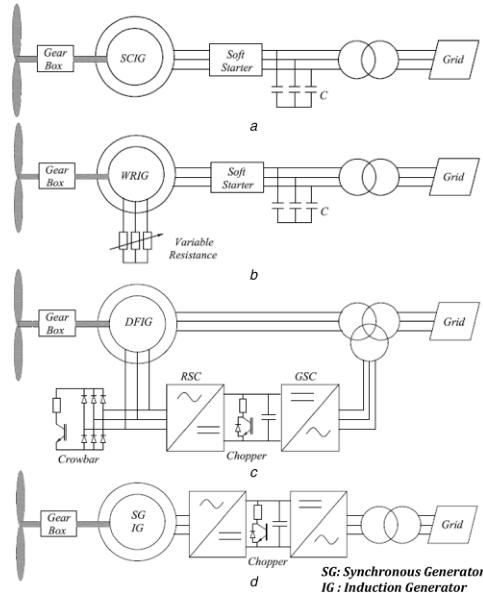

Fig. 2 Four types of the wind turbines [3] (a) Type A, (b) Type B, (c) Type C and (d) Type D 
  

The WAMS based on GPS and PMU is a sample system that is applied in a practical power system in some regions. Now, the power grid becomes very complex and the networks become the huge reason that gave failure to face the demand of power system modernisation. The phasor measurements can also apply a central control unit.  

Fig. 4 shows more extension for the WAMPAC. It represents the power system with PMU. The sensors are selected substations as a recommendation from the system operations and planning. The PMUs measure simultaneously some parameters such as voltage, the magnitude of angle and current. The parameters are synchronised with GPS time stamping with \(1\mu \mathrm{s}\) accuracy. The phasor quantities of the positive sequence of the voltage and also the current extracted from three- phase data. The PDC is used to gather and archive synchronised information. The PMU functionality will process the data received from the measurements and deliver synchronised to the application. The PDCs achieve the network bandwidth, data collection and PMU data synchronisation for more applications [9].  

The main WAMPAC can be achieved in the PMU in addition to its functions as data collection and acting as a server. The PMU assists in data collection in a server and acts as WAMPAC device. Fig. 5 shows the WAMPAC system solution. Some modules respond faster to isolate away the faulted portion. The PMU is designed to locate in an essential location on the power system. This location can be substations, generation buses or at interconnection points. The captured data is synchronised using GPS timing signals. The PMU sends through communication media the data to PDC that collects these data. The data is exported in the shape of the stream once they received from PMU by PDC and then correlated and normalised. The response of the wide- area control architecture is achieved through the control scheme. On a geographic wide area, the static and dynamic data can be collected and observed in a centralised control centre using the wide- area measurement and control [8- 10].  

### 3.1 Application of WAMS  

The non- real- time and real- time applications need WAMSs. They can produce dynamic continuous data. Also, WAMS produces

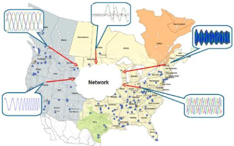

Fig. 3 WAMPAC concept [8] 
  

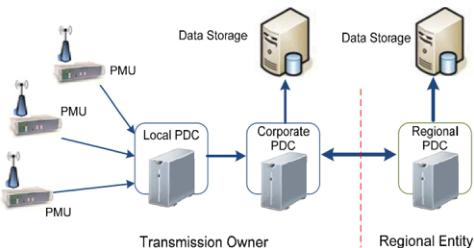

Fig. 4 WAMS with control action [9] 
  

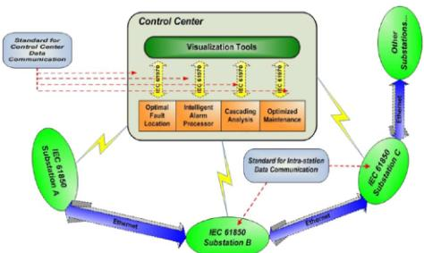

Fig. 5 WAMPAC system solution [8] 
  

synchronised data from the grid. The continuous measurements can be fed with the data in a stream form for online monitoring and control. It operates in real- time form. The supervisory control and data acquisition (SCADA) can produce data in the analogue form in \(5 - 10\mathrm{s}\) range. The WAMS can verify the real- time requirements with \(< 1\mathrm{s}\) time delay for the control system. The application of PMUs is restricted by data collection for event analysis after fault occurrence.  

The research groups can be classified into three levels:  

- Power system monitoring.- Advanced wide-area protection.- Advanced control schemes.  

The application can be one step further beyond the fundamental scope of WAMS. The main concern was for real- time protection and control [8]. Fig. 5 shows centralised monitoring and control architecture that use WAMS technology in real- time control. The WAMPAC has two categories: local applications in substation and system applications regional operation centres. At the substation, there are many monitoring and control applications. These applications will assist system operation.  

### 3.2 Frequency monitoring network  

The essential parameter in the power system is the frequency used for determination of the performance of the power grid. The frequency monitoring network (FNET) is established in 2000 [10]. The main purpose of the FNET is to establish low cost and fast deployment for frequency measurement with high accuracy in dynamic with very minimal cost. WAMS based on FNET was constructed by using the frequency disturbance recorders (FDR) data collected from different places. The FDR behaves like a single- phase PMU, while it can operate on a single phase and give the phase angle, voltage and frequency from a single- phase source.  

### 3.3 Phasor DC  

The PDC collects phasor data and is considered as a logical unit. It can also discrete event data from PMU's and other PDC's. Then, it can transmit the data to other applications. Sometimes, the data needs to be aligned and also other tasks, so PDCs' have the capacity to store buffer data for a certain time. Finally, the PDC has the capability of data receiving, storing, transmitting GPS data and aligning.  

## 4 Protection schemes using WAMS  

### 4.1 Fail to trip (FTT) schemes based protection  

One of the most interested protection schemes in the power grid disturbances is the false operation and FTT of protection. Most of the false operations in relays are the unwanted trips that may cause and propagate high disturbance. A CIGRE study sets that \(27\%\) of volume power grid disturbances caused according to the FTT of the protection system. Concerning the power systems security, the conventional algorithms act as backup protections that are not actually the correct selection because the coordination of individual relays is hard. The protection layout principle requires innovation to cope with some problems [11, 12].  

### 4.2 Backup schemes based protection  

The local backup protection centres (LBPCs) are included in one of the layers. Each layer can interface with a unit of PMUs. The system backup protection centres are located at the top layer. This layer acts with the coordinator for the LBPCs. The communication links can connect via fibre optic. Such elements can process smart techniques using local data gathering. Such ideas can apply PMUs to fulfil real- time need [13].  

The proper protection and control coordination is a prime challenge of the successful emergency procedure. Some other techniques can initiate load shed to stop rapid frequency through decline scheme [14]. The time of decision depends on the proper selection for measures of protection remedial and implementation.  

Similar to these techniques discussed in [15- 17] as out of step detection. Such techniques can prevent instability, swings and other fault condition. These techniques can be used by detecting and distinguishing faults based on monitoring the performance of the impedance loci at different buses. The angles between buses can be used through stability limits for every line. The criteria of the angle difference will be adjusted for a certain limit.  

The study in [18] is used to detect and provide preventive and protective actions for some fault conditions. Special protection system (SPS) that is referred to as remedial action schemes (RASs) are introduced to address system- wide operating conditions. There are some reports that explore SPS's and a new idea of WAMPAC. Madani et al. in [18] discussed flexible and reliable scheme of protection with communication media. Begovic et al. in [19] explained the disturbance occurred on a power grid and its impact on the network, control and protection actions that can stop further degradation in the power grid. Then, the power system can be restored to its original state and reduce the effect of the disturbance. There are some slowly developed disturbances and there are some control actions that can be used in case of fast disturbance. All the requirements of mechanical, electromagnetic compatibility (EMC) and thermal can be handled by the protection system.

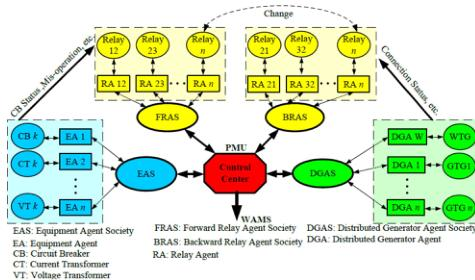

Fig. 6 Architecture of MAS-based adaptive protection system [23].1 
  

### 4.3 Stability schemes based protection  

4.3 Stability schemes based protectionBegovic and Novosel in [20] developed WAM based on protection system against a variety of instabilities. The proposed technique is based on time- synchronised PMU, which give system dynamic. The work permits applications with implementation for both cases of local and centralised according to the media of communication. The stability assessment and actions of system stability can be moulded in SPS. The study given in [21] provides a wide- area power system with automated grid systems that has reliable communication media. The system is highly coordinated with high skill and stability mode. Rehtanz and Bertsch in [21] provided WAMPAC that leading design need for reliability improvement and enhances stability and control. The main feature of this paper is the IT development to get flexibility and intelligence in WAMPAC through worldwide interoperability for microwave access (WiMAX) communication media.  

### 4.4 distributed generation (DG) effects on the protection  

The self- organisation system is known as multi- agent system (MAS) that is explained as a computerised system consisting of numerous smart agents. The communication can help in each independent agent as being had the freedom to share in or departure a group to cope with other agents [22]. The penetration of DG produces challenges for the conventional protection. The proposed protection algorithms are applied to a real grid and the findings explained the power of MAS in protection schemes [23]. Fig. 6 shows the main architecture of MAS- based adaptive protection system.  

Serizawa et al. [24] added communication requirements for the wide- area differential concept. The telecommunication media may need sampling synchronisation function. Serizawa et al. and Kangvansaichol and Crossleyin [25, 26] apply local information for protecting multizone based on current differential protection scheme. The time delayed for the remote side impeded for the tradition distance relays is cancelled.  

Terzija et al. in [27] designed and practically implemented a WAMPAC system against long- term voltage collapse in a SCADA system in Sweden. A model predictive method given in [28] is based on the coordinated system protection scheme (CSPS). The concept is based on the current state at various inputs and for several different candidate input successions. The control system is a predictive model and the search is based on a tree based on the CSPS and voltage collapse [29]. Such a scheme can optimise the operation of the generator, tap changer and load shedding controls using coordinates' dissimilar and discrete controls with soft and hard constraints of voltages and currents in the grid.  

The faults are rapidly detected if the wide- area system impeded with fast speed protection devices. Also, it can be integrated with a relaying system to protect power grid to avoid disturbance and let the system be reliable and stable. To get matching between the protections and control measures a 3 ph defence line is used [30]. The wide- area relaying can be operated in parallel with the main traditional protection. The main and backup protections can be covered by the wide- area relaying system.  

### 4.5 Backup schemes based wide-area protection  

Authors in [31- 34] explained backup protection based on WAMS. A protection algorithm of WAMS- based protection against chain overload trip (PACOLT) is proposed in [33]. The main architecture of PACOLT based on multi- agent technology is given in more details in this paper. WAMPAC is applied on the level of the distribution network in [34]. The central and local modules at \(110\mathrm{kV}\) substations are the main components of the WAMPAC system. The main functions of WAMPAC can be integrated into the grid (such as a transformer, feeder, busbar circuit breaker (CB) fail protection etc.). However, standby supply restoration, generations tripping, synch check, auto- reclose and load shedding are the main components of the control function. The generations are embedded in the local area distribution network. The load can be shed by tripping excess units in case of islanding. The frequency closes to \(50\mathrm{Hz}\) to meet the SynchCheck criteria; the grid supply is restored as an island area if auto- closing occurred for a circuit breaker on standby supply.  

Wen et al. in [34] used area data to quickly interrupt the fault through parallel multiple agents in the backup WAMP. A WAMP agent with a degree of tolerance is designed in [35] by using data fault about directionality and distance action. The working concept of the proposed agent is to first locate the fault through comparison between different fault direction informations and then conduct fault- tolerance processing by using fault confirmation ring and distance action information. The role element in the system is the communication now; the engineers started to understand the main features of the WAMS based on communication.  

Relay protection is an important defence line for grid security, its reliability and quick action will directly affect the safe operation of the grid. Cascading outages or blackout at home and abroad in recent years show that in different extents the backup protection incorrect tripping is the role reason for the grid collapse in large area, and any failure of electrical components or wrong operation during equipment checks may cause power flow transferring, which contributes to the rapid depravation of backup protection [36]. With the development of WAMS and communication technology, a kind of WAMP based on gathering information from many points in power system has been paid more and more attention from scholars all over the world [37].  

A WAMP technique based on longitudinal comparison concept is discussed in [38- 40]. WAMP system gathers data information concerning the directionality based on IEDs in a different zone and calculates site faults using protection action factor and relationship factor. The \(N - 1\) operation statuses in relaying protection system are defined by benefiting from the \(N - 1\) concept in power system analysis field. The relaying protection \(N - 1\) operation statuses are analysed and the strategies to reduce influences caused by \(N - 1\) operation statuses based on data information from wide- area are proposed. The results concluded that longitudinal comparison concept is straight forward for fault detection; the estimation results of the fault are exact and immune against \(N - 1\) operation statuses, which can get better for relaying performance [38- 40].  

The protection system, as the main defence in the power grid, has been put forward higher requirements than ever before owing to the complex structure of power grid nowadays. WAMP system based on information collected from wide- area multi- point is bound to be increased by the communication level in the process of conversion to engineering practise. The complex architecture of the power grid is divided using the limitedness of wide area monitoring protection and control. As a practical application of WAMP, novel layout architecture and a fault detection algorithm for zone- division WAMP were proposed in [38- 40] and then the hierarchy of WAMP was established. In each divided area, the fault detection and protection action are carried out to relieve the stress on the communication system. The protection proposed in this paper can be used as the main protection and also as a backup for the same time. IEEE 39- bus network model is taken as the example to verify regional division method. Case study result further verifies the effectiveness of the division method and the identification algorithm.

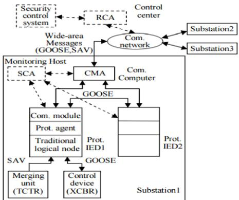

Fig. 7 WAMP infrastructure with backup and MAS using IEC61850 [41] 
  

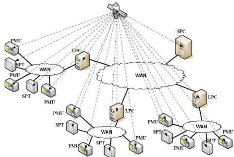

Fig. 8 Structure of three-level WAMP system [49] 
  

Study given in [41] showed the agent- based WAMP working as backup to enhance the power grid security. Fig. 7 shows the main structure of WAMP backup with MAS based on IEC- 61850.  

The DG is an attractive area that can help electrical engineers. The main problems that arise from DG's application are reducing efficiency and adequacy of protection schemes. The currents flowed from the DG's to a distribution network cause problems for protection schemes. Jun et al. in [42] first started analysing the effects of DGs on the distribution network. The protection system can be built to be used fully utilising commuter intelligence based on MAS. In view of the main problems facing traditional relay protection system, the research actualities of the wide- area relay protection algorithm are described. Two structural modes, i.e. the centralised and distributed modes of WAMP system are presented in [42]. The agent and network- based WAMP schemes are expounded, and the advantages of WAMP system over traditional protection are summarised. Problems to be solved in further study are indicated as well.  

### 4.6 Main schemes based on WAM  

Sheng et al. in [43] designed the infrastructure of multi- agent with distributed wide- area differential protection (DWADP). DWADP is extended in [44, 45]. The scheme produces optimal responses utilising the communication with neighbours and intelligent relays rather than the wide communication. Düstegör et al. in [46] gave MAS protection with high reliability of faults. The MAS consists of interacting smart agents. The agent interaction with the environment is discussed in [47]. Russell Stuart and Norvig and Xu et al. in [48, 49] applied the smart devices of PMU for achieving system protection. The system is based on local protection centre local protection center connected with many PMU and system  

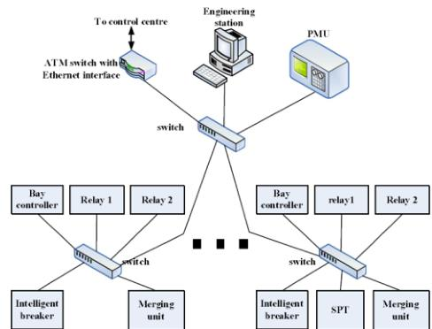

Fig. 9 Communication network topology for three-level WAMP [49] 
  

protection terminals with fibre- optic network, as given in Fig. 8. Begovic et al. in [50] suggested the design structure of the WAMP and gave partition for the protected zone. The study can solve partially some weaknesses of the conventional protection system, see Fig. 8 and 9.  

The fast actions of the protection and control are needed to terminate the power grid degradation during power grid disturbance and then restore it to a normal state. Some Begovic et al. in [50] focused on the system protection and RASs, the centralised and decentralised concepts are used. Karlsson et al. in [51] implemented different strategies for wide- area protection with different applications and solutions. The PMU's improved the observability of the grid dynamic. Multi- agent has recently been developed using WAMP with backup features. The cooperative modelling and multi- agent design mechanism are studied in [52] based on new protection technique. The protection terminal is designed to help mechanical, EMC, thermal and other requirements. The interfaces with the protection system are discussed in [53]. As given in the figure, the terminal is interfaced substation, current transformers and voltage transformers. The protection terminals are interfaced with a communication media.  

Cong et al. in [54] proposed three defensive lines that can be merged with relay protection functionality and emergency control, asynchrony detection and WAMPAC. The study given in [55] described a method for establishing WADP. The method is going to establish selectivity, less outage of zones and high- speed times. For verification, the telecommunication with protection schemes based on the microprocessor is given. The protection functionality is based on the wideband packet with local area network and GPS. A multi- agent- based adaptive WADP system is given in [56]. The power system is classified to main and backup- relays that operate online using the expert system.  

Wide- area adaptive protection can enhance coordination of backup protection with wide- area information and the load shedding rescheduling is used. Qing et al. in [57] developed an expert system based on graph theory. The power zone is divided into zones and the load shedding can be applied.  

Liu et al. in [58] gave high communication speed with more resilience protection system. The main function of that is to get high security for the protection system. A WAMP system is designed for encountering large disturbances that can assist power grid reliability and to extend the capacity of transmission lines. WAMP including wide- area directional comparison protection and WADP are discussed in [59- 61]. The principle is given to discriminate the faulted zone correctly when the data is collected.  

When the information is collected, an accurate fault decision can be obtained. Through the communication media, synchronised data from many substations are given by wide- area protection. During signal, disturbance causes wide- area information errors and the WAP decision is deteriorated with minimum reliability [62].  

The wide- area current can work as backup protection for differential protection; such a scheme needs to be synchronised and

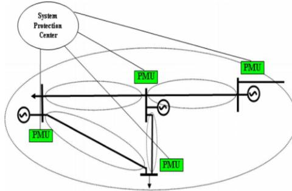

Fig. 10 Tradition and new protected zones [68] 
  

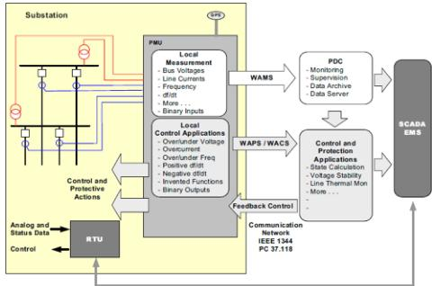

Fig. 11 WAMPAC [77] 
  

exchanged data [63]. The idea can be extended to use multi- objective evolutionary approach like [64]. RAS's which comprise bridge between protection and control systems is making schemes more effective. An innovation and new idea for protection and control using modern sensor and communication is studied in [65]. The effect of short lines, many events of faults and high fault resistance are studied. New bus sequence voltage with new partition is given in [66] as wide- area protection. All parameters of short lines and high fault resistance are considered.  

Kamwa et al. in [67] gave the concept of wide- area based on current differential explaining its sensitivity and stability for out of zone faults. The main function is the performance as unit protection relays can protect complex and large- scale power grids using PMU. The positive sequence magnitude is computed at each bus and compared to select the faulted area. The measurements can be taken during events entire the protection centre to distinguish the faulted area and bus. The data is collected in a control protection centre through communication media for getting relay decision. Using one and only one decision instead of a separate decision is given to satisfy high stability and reliability, see Fig. 10.  

The design of the architecture, functionality and workflow is given in WAMP with backup. The problems of miss- operation, failure in protection or communication are dealt by WAMP with backup and MAS. Eissa et al. in [68] provided a WAMP with a backup scheme using data information through communication media. At two ends of the transmission line, the data is collected and line decision- making agent is used. The network infrastructure with communication is proposed in [69] that based concept of supervisory and an agent based on an ad hoc backup relay protection algorithm. A WAMP with backup using steady- state voltages and currents component is given in [70]. Protection correlation regions (PCRs) are used at the buses to form wide PMU on the network topology. The fault component voltage distribution- based WAMP with the backup algorithm is proposed in [71].  

The steady- state component of various current signals in each PCR is utilised to find the fault. The synchronised PMU measures based on WAMP with the backup scheme is proposed [72]. The faulted branch is identified using the cosine sign between the voltage and current signals at ends of the transmission line. The problem of the encroachment and power swing is solved in this idea. The main feature of the technique is it does not need complex coordination and the communication scheme fastens the speed that can help the backup protection.  

Bertsch et al. in [73] suggested RAS based on wide- area protection. As concerning the classification of conventional real- time system and the consideration of meeting the requirement of transmission time limit, the real- time system of wide- area communication is classified into the hard real- time system, soft real- time system and non- real- time system. Concepts and characteristics of these three systems are introduced and advantages of the soft real- time system compared with the hard real- time system are analysed in [74], which prove that the soft real- time communication technology can meet requirements of the WAMP much better. The WADP used real- time communication and referring equivalence synchronism is presented and its sampling synchronism principle and protection theory are introduced with real- time strategic power infrastructure defence (SPID) with an adaptive protection and control [75].  

The SPID is considered as the hot topic for defence systems. The SPID system introduces the failure analysis, vulnerability assessment and adaptive control actions to assist grid outages. The increasing in the load behind the limit of design is a challenge for the transmission system infrastructure and that can be done through a power system protection system [76]. The applications of PMU with WAMPAC system is extended in [77] as shown in Fig. 11.  

Merging the recent development of the power grid with the practical wide- area protection to use wide- area smart protection- based abundant information [78]. Wang et al. in [79] classified the study into three parts: reviewing the phasor technology in different parts, give the real- time wide- area applications and the third part is to summarise the data requirements extracted from the phasors. Abbasi et al. in [80] gave the market and environmental constraints' grid systems priority to work with their limits and apply the assets in a good manner. Zima et al. in [81] explained the improvement of the performance, monitoring and continued load growth without adding more transmission resources and low margins in the operation that reduce the operational margins for many power systems. The smart grid with latest communication media is studied in [82] to cope with the digital society. The main topic of the study is utilising IT to obtain more flexibility and intelligence in the WAMS using WiMAX. Some papers gave high accuracy in the backup protection schemes with high speed and more reliable behaviour for precisely identifying the fault type and location such as [83]. The analysis of cluster theory is used in the backup schemes.  

The adaptive control and other measures form part of a move toward the creation of active distribution networks [84]. The protection can ensure the interruption of supply is given in [85]. The current protection challenges and solutions for distributed generation penetration in the distribution system are discussed in many papers [86- 92]. The protection schemes using overcurrent relays and fuses for re- coordination are well extensively discussed and covered. The other algorithms will define the protection as backup protection based on distance relays.  

WAM offers many opportunities to improve the performance of power system protection. This paper presents some of these opportunities and the motivation for their development. These methods include monitoring the suitability of relay characteristics [93]. Elghazaly et al. [94] propose a wide- area backup protection technique for transmission lines using a limited number of PMUs.  

All the above- surveyed work do not provide a solution for the smart grid system with renewable resources and stand- alone protection schemes are still applied in the wide system. In case of renewable sources penetration, many of operating parameters change and cause failure for the protection stability. Many cases of the blackout are recorded. Most of the protection schemes are used as backup protections. The other factor is the relays which use as

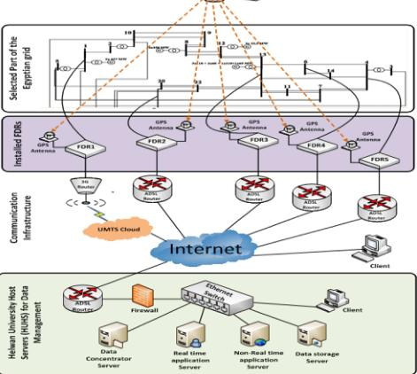

Fig. 12 EWAMS smart grid main face page developed by Eissa [100] 
  

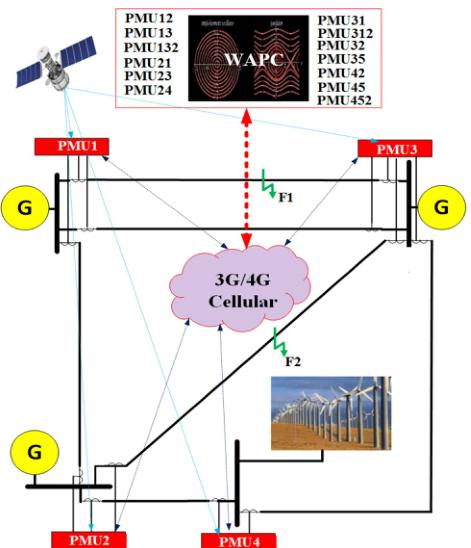

Fig. 13 PMU module connection with the new concept 
  

distance principle. Generally, all these factors cause challenges for the smart grid with renewable resources protection. A novel scheme for solving such problems should be provided.  

### 4.7 New developed WAMS  

Recently, authors of this paper provided much research in [95- 100] that developed WAMS based on FDRs, see Fig. 12. The development, management and grid parameters monitoring is the main purpose of the project. The idea depends on using FDR's with high- speed communication media and high- technology computer architecture for real- time applications. The main feature of the project is raising the efficiency of the utility grid using very unique applications in real- time. The FNET is an Internet- based, GPS- synchronised, WAMS providing a low- cost and easily deployable solution. Eissa in [101] introduced a solution for the complex smart grid protection using the wireless WiMAX technology with centralised and distributed scheduling mechanisms. All the protection status and the coordination scheme are embedded in the  

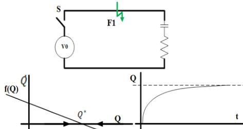

Fig. 14 \(R - C\) circuit with phase portrait and time domain [103, 104] 
  

switching centre. Eissa [102] presented a new wide- area phase plane primary protection scheme interconnected electric bulk power system protection. The main purpose is to get a decision based on data sharing instead of the traditional primary stand- alone relays.  

## 5 Case study Egyptian wide area monitoring system developed by authors  

One of the great applications in this project is solving the problem of the system protection in case of renewable sources penetration. The studied configuration system is given in Fig. 13. A new main protection technique for WAMS with wind farms using 3D phase surface concept that does not depend on the short- circuit current magnitude is developed. To achieve this concept of protection on a complex network, the WAMS with PMUs is used. The WAPC employs real- time information with grid communications' infrastructure, particularly in protecting extra high voltage/high voltage transmission substations, see Fig. 13.  

Four PMUs are located on four different zones. PMU#1, PMU#2, PMU#3 and PMU#4 are used to protect all the transmission lines connected around area#1, area#2, area#3 and area#4. The transmission lines connected between PMU#1 and PMU#3 are double circuits. All other transmission lines are single circuits. Generation source of type doubly fed induction generator (DFIG) is installed at bus 4. At first, a three- phase fault is occurred at F2 between PMU#2 and PMU#4 (area#2- area#4), see Fig. 13. Let us explain the following example to show how the phase portrait can solve the differential equation on \(x - y\) diagram and find a solution for the transmission line differential equation given in Fig. 13.  

Consider the electrical circuit given in Fig. 14. Suppose the switch is closed at \(t = 0\) , let \(Q(t)\) denote the charge at the time \(t > 0\) . Let us show the relation between \(Q(t)\) as a solution and phase portrait. The circuit equation can be described as \(- V_{0} + R\dot{I} + (Q/C) = 0\) , \(I\) is the current flowing through the resistor and this equation can be given as \(- V_{0} + R\dot{Q} + (Q/C) = 0\) or \(\dot{Q} = f(Q) = (V_{0} / R) - (Q / RC)\) [103, 104]. The graph of \(f(Q)\) is a straight line with a negative slope. The vector field has a fixed point where \(f(Q) = 0\) , which occurs at \(Q^{*} = CV_{0}\) . The flow is to the right where \(f(Q) > 0\) . If the flow is toward \(Q^{*}\) , it is a stable fixed point (stable). Fig. 14 shows the solution of the above equation in the time domain while the fixed point is the same as \(CV_{0}\) [103, 104]. This a simple example showing how the phase portrait solves the differential equation on \(Q^{*} := Q\) . The phase portrait equations to describe the studied configuration system are given in Fig. 14.  

For the studied system given in Fig. 13, the lines can be put in the form of 2D system as [103, 104]  

\[\dot{x} = ax + by\] \[\dot{y} = cx + dy\]  

where \(a\) , \(b\) , \(c\) , \(d\) are transmission line parameters and can be put in the following form:

\[\dot{X} = AX\]  

The solutions of \(\dot{X} = AX\) can be given as trajectories moving on the \((x,y)\) plane, which is called 'phase plane'. So, assume the transmission line is given by the following differential equation [101, 102]:  

\[m\ddot{x} +kx = 0 \quad (1)\]  

Assume \(m\) and \(k\) are constants and \(x\) is the current of the equilibrium transmission line. The following will show how we can build the phase plane for this dynamic transmission line. The above equation can be solved in terms of sines and cosines, but if the equation is non- linear it is impossible to solve it (the case of short circuit), so the main target is to find an analytical solution or simply its behaviour without actually solving these equations. The motion in the phase plane can be described by a vector field that comes from the above differential equation. To find this vector field, the state of the system is characterised by its current \(x\) and derivative \(y\) ; so if we know the values of both \(x\) and \(y\) , then (1) uniquely determines the future states of the system. Equation (1) can be rewritten in terms of \(x\) and \(y\) as follows [103, 104]:  

\[\begin{array}{c}\dot{x} = y\\ \dot{y} = -\frac{k}{m} x = -\beta^2 x \end{array} \quad (3)\]  

The system given in (2) and (3) assigns a vector \((\dot{x},\dot{y}) = (y, - \beta^2 x)\) at each point \((x,y)\) and this represents a vector field on the phase plane. When \(y = 0\) \((\dot{x},\dot{y}) = (0, - \beta^2 x)\) . The vectors point vertically downward for positive \(x\) and vertically upward for negative \(x\) , see Fig. 15a. When \(x\) gets larger in magnitude, the vectors \((0, - \beta^2 x)\) get longer. The same on the \(y\) - axis, the vector field is \((\dot{x},\dot{y}) = (y,0)\) that addresses to the right when \(y\) is larger than zero and to the left when \(y\) is going \(< 0\) .  

As shown in Fig. 15a, the vectors can change the direction. According to the \((\dot{x},\dot{y}) = (y, - \beta^2 x)\) , the trajectory starts at \((x_0,y_0)\) and moves as shown in Fig. 15b. As shown in this figure, the origin is a fixed point. The phase point is starting anywhere and then circulates around the origin and returns to the starting point. The trajectories form closed orbits as shown in Fig. 15b. This is called the phase portrait [103, 104].  

Fig. 16 is called the 'phase portrait' in 3D and the curves are called the 'trajectories' in 3D. The differential equations in the studied system contain the second variable such as sin or cos with the angle \(\theta\) , the 3D system is established as \(\dot{x} = X(x,y,t)\) , \(\dot{y} = Y(x,y,t)\) , where \(X\) and \(Y\) are periodic in the period \(T\) and \(t\) as: \(\dot{x} = X(x,y,(2\pi /T)\theta)\) , \(\dot{y} = Y(x,y,(2\pi /T)\theta)\) , \(\dot{\theta} = 2\pi /T\) . \(X\) describes \(X\) as the current at one end of the transmission line and \(Y\) can describe the first derivative current at the same end of the transmission line, for the system given in Fig. 13. The figure shows two cases of the trajectories' performances [(stable) and (unstable)]. For a stable system, the trajectory flows toward the equilibrium axis and for the unstable system, the trajectory flows away from the equilibrium axis.  

The system performance shows \(X:Y\) phase portrait as explained above. The 3D phase surface is established. The 'surface' is the dynamic equation of the transmission line. In the normal case and faults outside the protected zones, no solutions for the differential equations of the transmission line and the 'trajectories' started from the initial point and will be moved closely to equilibrium axis \(t\) , see Fig. 16. In case of short circuit in the protected zones, the 'trajectories' move from initial points and separated away from the time axis, see Fig. 16.  

To verify the new idea, a case study of three- phase fault occurred between bus 2 and bus 4. Fig. 17 shows the relay patterns that will be produced from 3D phase surface at the WAPC for all PMUs deployed on the configuration. The figure shows the performance of four PMUs. As given in Fig. 17 (first graph left) and third graph down, PMU#1 and PMU#3 produce six relay patterns titled by Relay12, Relay13, Relay132, Relay131, Relay132  

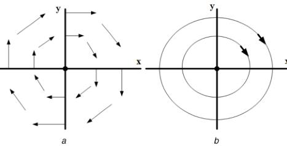

Fig. 15 Vector field performance and the phase portrait [103, 104] (a) vector field, (b) phase portrait 
  

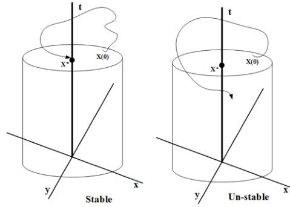

Fig. 16 Solution of the differential equations 
  

Relay32 and Relay34. This figure shows the 3D phase surface with the solution curves \(X\) , \(Y\) and samples. The figure clearly shows the solution curves for the relays that move closely to the equilibrium point. The next plot (right top) shows the PMU#2 with three relay patterns indicated by Relay12, Relay13, Relay132, Relay21, Relay23 and Relay24.  

The figure shows the 3D phase surface with the solution curves \(X\) , \(Y\) and samples. The figure clearly shows the solution curves with the faulted line 'Relay24' (blue line) widely separated from the equilibrium point and the other solution curves as Relay21 and Relay23 are located at the equilibrium point. The same for the fourth curve that shows Relay42 (red) moves separately from the equilibrium point. So, the relays Relay24 and Relay42 are totally separated from the equilibrium point. From this pattern, the faulted line can be easily recognised. In this case, the fault can be easily determined between Area# 2 and Area# 4. This decision can be taken inside WAPC given in Fig. 13. The fault pattern is taken and defined as one unit rather than stand- alone traditional techniques. The fault estimated and confirmed by many number of samples within 5 ms. The total time communication latency as an operating time for a tele- protection fibre- optic system and propagation time can be taken as 16 ms. That is a more suitable time for wide- area protection schemes compared with the time of the distance relays in the first zone (25 ms). Table 1 shows the parameter details of the studied system.  

## 6 Conclusion  

The above- surveyed work showed that the solution of a smart grid system with renewable resources is not yet considered for HV/EHV transmission systems. Most of the work provided showed that the protection schemes are working in a stand- alone manner and not considered the system as one unit protection. Moreover, most of the protection schemes are used as backup protections. In case of renewable sources penetration, many of operating parameters will change and cause failure for the protection stability. Many cases of blackout worldwide are recorded. As explained in this paper, many factors cause challenges for the smart grid with renewable resources protection. For this reason, a novel

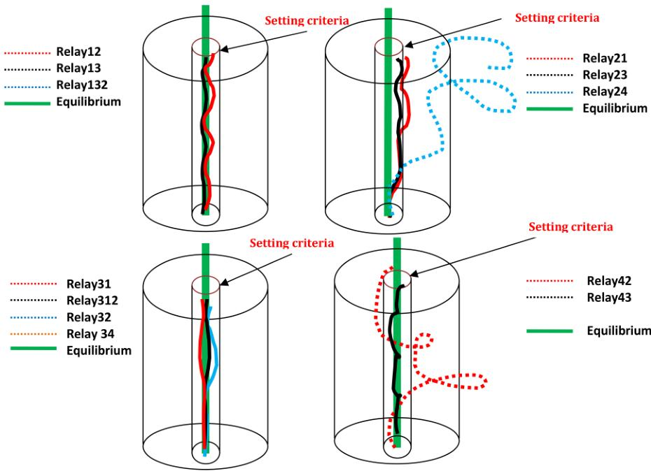

Fig. 17 Three-phase faults with breakers open and the '3D phase surface'-internal fault between area2 and area4 
  

Table 1 Lengths, zones, wind, transformers and PMUs   

<table><tr><td>Line</td><td>PMUs</td><td>Zones, V</td><td>Terminals</td><td>Length, km</td></tr><tr><td>1</td><td>PMU#1</td><td>area-1 (500 kV)</td><td>area-1</td><td>145</td></tr><tr><td>2</td><td>PMU#2</td><td>area-2 (500 kV)</td><td>area-2</td><td>125</td></tr><tr><td>3</td><td>PMU#3</td><td>area-3 (500 kV)</td><td>area-3</td><td>209</td></tr><tr><td>4</td><td>PMU#4</td><td>area-4 (500 kV)</td><td>area-4</td><td>160</td></tr><tr><td colspan="5">R/L = 39</td></tr><tr><td colspan="5">wind turbine generator data MVA = 2 for each turbine, MVAR = 0.7—0.7 MW = 2, source impedance = j0.8 pu MVA = 2.5, kV = 0.69/35, Ztr = 0.0073 + j0.065 pu MVA = 350, kV = 35/220, Ztr = 0.008 + j0.2 pu, Ytr = 0.0005 – j0.0015 pu</td></tr></table>  

scheme for solving such problems should be provided in a wide- area manner rather than operation in a stand- alone manner.  

Also, as given in many kinds of literatures; the opportunities offered by WAM for enhancing protection are attractive because of the emerging challenges faced by the modern power system protection. The increasingly variable operating conditions of power systems are making it even more difficult to select relay characteristics that will be a suitable compromise for all loading conditions and contingencies. Wide- area protection based on the main concept is highly needed.  

In the high- voltage transmission system, there are a number of potential challenges in integrating renewable sources with the existing grid due to the intermittent nature. The integration of variable sources causes unique challenges in system protection and setting. In case of penetration of variable energy sources, the smart grid should perform flexibly and strong. As a high level of renewable resources increase, a problem across power systems extension occurs. This reason limits the future of energy sustainability. The modern protection schemes are not able to solve this problem. This paper provides an extensive review about the challenges of integration renewable energy into the smart grid, the  

wide- area protection schemes and their limitations, examples of the current architecture of the wide- area, and finally a new solution to solve the problem. The idea is based on PMUs and first time phase portrait tool to solve the power grid complexity and extension due to renewable sources penetration. The results showed that the novel wide- area protection concept operates correctly for various types of faults.  

## 7 References  

[1] Shafiullah, G.M., Amanullah, M.T.O., Shawkat Ali, A.B.M., et al.: 'Smart grid for a sustainable future', Smart Grid Renew. Energy, 2013, 4, (1), p. 28119, doi: 10.4236/sgre.2013.41004[2] Global Smart Grid Federation: 2011. Available at http://www.globalsmartgridfederation.org/about.html, April 2018[3] Sulla, F.: 'Fault behavior of wind turbines'. Doctoral Dissertation, Department of Measurement Technology and Industrial Electrical Engineering, Lund University, 2012. Printed in Sweden by Tryckerieti E- huset, Lund University, Lund 2012[4] Petersson, A.: 'Analysis, modeling and control of doubly- fed induction generators for wind turbines'. PhD thesis, Chalmers University of Technology, Goteborg, Sweden, 2005

[5] Martinez, J., Kjaer, P.C., Rodriguez, P., et al.: Parameterization of a synchronous generator to represent a doubly fed induction generator with chopper protection for fault studies, Wind Energy, 2011, 14, (1), pp. 107- 118[6] Fang, X., Misra, S.: Smart grid- the new and improved power grid: a survey, IEEE commun. Surv. Tutor., 2011, 14, (4), pp. 944- 980[7] National Electric Sector Cybersecurity Organization Resource (NESCOR): 'Wide area monitoring, protection, and control systems (WAMPAC)', October 26 2012. Available at http://smartgrid.epri.com/doc/ESRFDS.pdf, April 2018[8] EPRI, Standards for Cyber Security Requirements Wide Area Monitoring, Protection, and Control Systems (WAMPAC), National Electric Sector Cybersecurity Organization Resource (NESCOR), Version 2.0, 26 October 2012[9] IEEE Standard for Synchrophasor Data Transfer for Power Systems, IEEE Power & Energy Society, Sponsored by the Power System Relaying Committee, IEEE Std. C37.118.2™- 2011, IEEE Std. C37.118™- 2005[10] Zhong, X., Xu, C., Billian, B.J., et al.: 'Power system frequency monitoring network implementation', IEEE Trans. Power Syst., 2005, 20, pp. 1914- 1921[11] Kezunovic, M., Popovic, T.: 'Wide area monitoring, protection, and control systems (WAMPAC)', 2007 IET- UK International Conference on Information and Communication Technology in Electrical Sciences (ICTES 2007), Tamil Nadu, India, 20- 22 December 2007[12] Wang, Y., Zhang, Y.- X., Xu, S.- X.: 'Wide- area protection against chain overload trip based on multi- agent technology', Int. Conf. Machine Learning and Cybernetics, 2008, vol. 3, pp. 1548- 1552, doi: 10.1109/ICMLC.2008.4620652[13] Phadke, A.G., Horowitz, S.H., Thorp, J.S.: 'Aspects of power system protection in the post- restructuring era', Proc. 32nd Hawaii Int. Conf. System Sciences, Maui, HI, USA, USA, 1999[14] Terzija, V., Cai, D., Valverde, G., et al.: 'Flexible wide area monitoring, protection and control applications in future power networks developments in power system protection (DPSP 2010)', 10th IET International Conference on Developments in Power System Protection (DPSP 2010), Manchester, UK, 29 March- 1 April 2010, pp. 1- 5, doi: 10.1049/cp.2010.0361[15] Moxley, R., Wronski, M.: 'Using time error differential measurement in protection applications', Presented at the 6th Annual Clemson University Power Systems Conference Clemson, South Carolina, March 13- 16 2007, pp. 278- 283, doi: 10.1109/PSAMP.2007.4740918[16] Phadke, A.G., Kasztenny, B.: 'Synchronized phasor and frequency measurement under transient conditions', IEEE Trans. Power Deliv., 2009, 24, (1), pp. 89- 95, doi: 10.1109/TPWRD.2008.2002665[17] De La Ree, J., Centeno, V., Thorp, J.S., et al.: 'Synchronized phasor measurement applications in power systems', IEEE Trans. Smart Grid, 2010, 1, (1), pp. 20- 27[18] Madani, V., Adamiak, M., Thakur, M.: 'Design and implementation of wide area special protection schemes', Available at https://www.gedigitalenergy.com/smartgrid/Apr06/ Wide_Area_Special_Protection_Schemes.pdf, April 2018[19] Begovic, M., Karlsson, D., Henville, C.: 'Wide- area protection and emergency control', Proc. IEEE, 2005, 93, (5), pp. 876- 891[20] Begovic, M., Novosel, D.: 'On wide area protection', 2007 IEEE Power Engineering Society General Meeting, Tampa, FL, USA, 24- 28 June 2007, pp. 1- 5[21] Rehtanz, C., Bertsch, J.: 'Wide area measurement and protection system for emergency voltage stability control', 2002 IEEE Power Engineering Society Winter Meeting, New York, NY, USA, 27- 31 Jan. 2002, vol. 2, pp. 842- 847[22] Kundur, P., Paserba, J., Ajjarapu, V., et al.: 'Definition and classification of power system stability IEEE/CIGRE joint task force on stability terms and definitions', IEEE Trans. Power Syst., 2004, 19, (3), pp. 1387- 1401[23] Liu, C., Rather, Z.H., Chen, Z., et al.: 'Multi- agent system based adaptive protection for dispersed generation integrated distribution systems', Int. J. Smart Grid Clean Energy, 2013, 2, (3), pp. 406- 412[24] Serizawa, Y., Imamura, H., Sugaya, N., et al.: 'Experimental examination of wide- area current differential backup protection employing broadband communications and time transfer systems', 1999 IEEE Power Engineering Society Summer Meeting, Edmonton, Alta., Canada, 18- 22 July 1999, vol. 2, pp. 1070- 1075[25] Serizawa, Y., Miyazaki, S., Shimizu, K.: 'Wide band digital communication requirements for differential teleportation', CIGRE Helsinki Symp., Finland, 1995, p. 600- 603[26] Kangvansaiichol, K., Crossley, P.A.: 'Multi- zone current differential protection for transmission networks', 2003 IEEE PES Transmission and Distribution Conference and Exposition, Dallas, TX, USA, 7- 12 Sept. 2003, vol. 1, pp. 359- 364[27] Terzija, V., Valverde, G., Cai, D., et al.: 'Wide- area monitoring, protection and control of future electric power networks', Proc. IEEE, 2011, 99, (1), pp. 80- 93[28] Ingelsson, A., Lindström, P.O., Karlsson, D., et al.: 'Wide- area protection against voltage collapse', IEEE Comput. Appl. Power, 1997, 10, (4), pp. 30- 35[29] Larsson, M., Hill, D.J., Olsson, G.: 'Emergency voltage control using search and predictive control', Int. J. Power Energy Syst., 2002, 24, (2), pp. 121- 130[30] Glavic, M., Van Cutsem, T.: 'Wide- area detection of voltage instability from synchronized phasor measurements. Part II: simulation results', IEEE Trans. Power Syst., 2009, 24, (3), pp. 1417- 1425[31] Rehtanz, C.: 'Online stability assessment and wide area protection based on phasor measurements'. Bulk Power System Dynamics and Control V, Onomichi, Japan, 26- 31 August 2001[32] Lv, Y., You, D., Wang, K., et al.: 'Study on wide- area backup protection system for the smart grid', 2011 4th International Conference on Electric Utility Deregulation and Restructuring and Power Technologies (DRPT), Weihai, Shandong, China, 6- 9 July 2011, pp. 218- 224  

[33] Wang, Y., Zhang, Y.- X., Xu, S.- X.: 'Wide- area protection against chain overload trip based on multi- agent technology', 2008 International Conference on Machine Learning and Cybernetics, Kunming, China, 12- 15 July 2008, vol. 3, pp. 1548- 1552[34] Wen, A., Zhao, M.Y., Li, J.S., et al.: 'Application of wide area monitoring protection and control in an electricity distribution network', 12th IET International Conference on Developments in Power System Protection (DPSP 2014), Copenhagen, Denmark, 31 March- 3 April 2014, pp. 1- 5, doi: 10.1049/cp.2014.0054[35] Sun, H., Liu, Q.: 'Research of the structure and working mechanisms of wide- area backup protection agent', 2009 First International Conference on Information Science and Engineering, Nanjing, China, 26- 28 Dec. 2009, pp. 5037- 5042, doi: 10.1109/ICISE.2009.926[36] Tor, Y., Fukui, Y., Kudo, H.A.: 'Cooperative protection system with an agent model', IEEE Trans. Power Deliv., 1998, 13, pp. 1060- 1066[37] Wang, X., Hopkinson, K.M., Thorp, J.S., et al.: 'Developing a novel backup protection system for the electric power grid using agents', Autom. Electr. Power Syst., 2005, 29, (21), pp. 50- 54[38] Zengli, Y., Dongyuan, S.H., Xianzhong, D.: 'Wide- area protection system based on direction comparison principle', Proc. CSEE, 2008, 28, (22), pp. 87- 93[39] Wei, C., Zhencun, P., Jianguo, Z.H.: 'A wide- area relaying protection algorithm based on longitudinal comparison principle', Proc. CSEE, 2006, 26, (21), pp. 8- 14[40] Liu, X., Wang, Y., Hu, H.: 'Fault identification algorithm based on zone- division wide area protection system', J. Eng. Sci. Technol. Rev., 2014, 7, (2), pp. 80- 86[41] Tong, X., Wang, X., Ding, L.: 'Study of information model for wide- area backup protection agent in substation based on IEC61850', 2008 Third International Conference on Electric Utility Deregulation and Restructuring and Power Technologies, Nanjing, China, 6- 9 April 2008, pp. 2212- 2216, doi: 10.1109/DRPT.2008.4523778[42] Jun, Q.L., Ying, W., Juan, H.C., et al.: 'Multi- agent system wide area protection considering distributed generation impact', 2011 International Conference on Advanced Power System Automation and Protection, Beijing, China, 16- 20 Oct. 2011, vol. 1, pp. 549- 553, doi: 10.1109/APAP.2011.6180462[43] Sheng, S., Zhong, D.X., Xiangjun, Z., et al.: 'A multi- agent based wide- area current differential protection system [J]', Power Syst. Technol., 2005, 29, (14), pp. 15- 19[44] Sheng, S., Li, K.K., Chan, W.L., et al.: 'Adaptive agent- based wide- area current differential protection system', IEEE Trans. Ind. Appl., 2010, 46, (5), pp. 2111- 2117[45] Zhu, Y., Song, S., Wang, D.: 'Multiagents- based wide area protection with best- effort adaptive strategy', Int. J. Electr. Power Energy Syst., 2009, 31, (2), pp. 94- 99[46] Düstegör, D., Poroseva, S.V., Hussaini, M.Y., et al.: 'Automated graph- based methodology for fault detection and location in power systems', IEEE Trans. Power Deliv., 2010, 25, (2), pp. 638- 646[47] Ductegor, D.: 'An agent- based wide area protection scheme for self- healing grids innovative smart grid technologies', 2011 IEEE PES Conference on Innovative Smart Grid Technologies - Middle East, Jeddah, Saudi Arabia, 17- 20 Dec. 2011, pp. 1- 6, doi: 10.1109/ISTGT-MidEast.2011.6220803[48] Russell Stuart, J., Norvig, P.: 'Artificial intelligence: a modern approach' (Prentice- Hall, Upper Saddle River, NJ, 2003, 2nd edn.), ch. 2. ISBN 0- 13- 790395- 2. Available at http://aima.cs.berkeley.edu/, April 2018[49] Xu, T., Yin, X., You, D., et al.: 'A novel communication network for three- level wide area protection system', 2008 IEEE Power and Energy Society General Meeting - Conversion and Delivery of Electrical Energy in the 21st Century, Pittsburgh, PA, USA, 20- 24 July 2008, pp. 1- 8, doi: 10.1109/ PES.2008.4596363[50] Begovic, M., Novosel, D., Karlsson, D., et al.: 'Wide- area protection and emergency', Proc. IEEE, 2005, 93, (5), pp. 876- 891[51] Karlsson, D., Messing, L., Akke, M.: 'Wide area protection and emergency control', Proc. IEEE, 2005, 93, (5), pp. 876- 891[52] Bertsch, J., Carnal, C., Karlsson, D., et al.: 'Wide- area protection and power system utilization'. Available at http://www.science.smith.edu/~jcardell/ Readings/TRUST%20US/IEEE%20Proc%20May%202005/WideArea %20Protec%20-%20Bertsch.pdf, April 2018[53] Tong, X., Wang, X., Tang, J.: 'The cooperative modeling of wide- area protection multi- agent based on organization', 2006 International Conference on Power System Technology, Chongqing, China, 22- 26 Oct. 2006, pp. 1- 6, doi: 10.1109/ICPS.2006.321825[54] Cong, W., Pan, Z., Ding, L.: 'Study of a high- speed communication network based wide- area protection system'. Proc. 2004 IEE Development in Power System Protection Conf., 2004, pp. 689- 692[55] Cong, W., Pan, Z., Ding, L.: 'A wide area protection system based on 'three defensive lines' and its application in power system', 2004 International Conference on Power System Technology, 2004, PowerCon 2004, Singapore, 21- 24 Nov. 2004, vol. 1, pp. 718- 722, doi: 10.1109/ICPS.2004.1460086[56] Serizawa, Y., Imamura, H., Sugaya, N., et al.: 'Experimental examination of wide- area current differential back up protection employing broadband communications and time transfer systems', 1999 IEEE Power Engineering Society Summer Meeting. Conference Proceedings (Cat. No.99CH36364), Edmonton, Alta., Canada, 18- 22 July 1999, vol. 2, pp. 1070- 1075[57] Qing, L., Xiaobo, X., Yan, X.: 'Wide area protection algorithm based on main/auxiliary type', 2012 IEEE Int. Conf. Power System Technology (POWERCON), 2012, pp. 1- 6, doi: 10.1109/PowerCon.2012.6401269[58] Liu, Z., Chen, Z., Sun, H., et al.: 'Control and protection cooperation strategy for voltage instability', 47th Int. Universities Power Engineering Conf. (UPEC), 2012

[59] Begovic, M.: 'Trends in power system wide area protection power systems'. 2004 IEEE PES Conf. Exposition, 2004, vol. 3, pp. 1612- 1613, doi: 10.1109/ PSCE.2004.1397745[60] He, Z., Zhang, Z., Chen, W., et al.: 'Wide-area backup protection algorithm based on fault component voltage distribution', IEEE Trans. Power Deliv., 2011, 26, (4), pp. 2752- 2760[61] Sheng, S., Ki, K.K., Chan, W.L., et al.: 'Agent based self- healing protection system', IEEE Trans. Power Deliv., 2006, 21, (2), pp. 610- 618[62] Serizawa, Y., Myoujin, M., Kitamura, K., et al.: 'Wide- area current differential backup protection employing broadband communications and time transfer systems', IEEE Trans. Power Deliv., 1998, 13, (4), pp. 1046- 1052[63] He, Z., Zhang, Z., Yin, X., et al.: 'A novel algorithm of wide area backup protection based on fault component comparison'. 2010 International Conference on Power System Technology, Hangzhou, China, 24- 28 Oct. 2010, pp. 1- 7, doi: 10.1109/POWERCON.2010.5666146[64] Lee, Y., Choi, T.J., Ahn, C.W.: 'A Multi- Objective Evolutionary Approach to Selecting Security Solutions', CAAI Trans. on Intell. Technol., 2017, 2, (2), pp. 62- 67[65] Serizawa, Y., Myoujin, M., Kitamura, K., et al.: 'Wide- area current differential backup protection employing broadband communications and time transfer systems', IEEE Trans. Power Deliv., 1998, 13, (3), pp. 1046- 1052, doi: 10.1109/61.714445[66] Adamiak, M.G., Apostolov, A.P., Begovic, M.M., et al.: 'Wide area protection- technology and infrastructures', IEEE Trans. Power Deliv., 2006, 21, pp. 601- 609[67] Kamwa, I., Pradhan, A.K., Joos, G.: 'Adaptive phasor and frequency- tracking schemes for wide- area protection and control', IEEE Trans. Power Deliv., 2011, 26, (2), pp. 744- 753, doi: 10.1109/TPWRD.2009.2039152[68] Eissa, M.M., Masoud, M.E., Elanwar, M.M.M.: 'A back up wide area protection technique for power transmission grids using phasor measurement unit', IEEE Trans. Power Deliv., 2010, 25, (1), pp. 270- 278[69] Tong, X., Wang, X., Wang, R., et al.: 'The study of a regional decentralized peer- to- peer negotiation- based wide- area backup protection multi- agent', IEEE Trans. Syst. Smart Grid, 2013, 4, (2), pp. 1197- 1206, doi: 10.1109/ TSG.2012.2223723[70] Lin, H., Sambamoorthy, S., Shukla, S., et al.: 'Ad- hoc vs. supervisory wide area backup relay protection validated on power/network co- simulation platform'. Presented at the 17th Power Syst. Comput. Conf., Stockholm, Sweden, 22- 26 August 2011[71] Ma, J., Li, J., Thorp, J.S., et al.: 'A fault steady state component- based wide area backup protection algorithm', IEEE Trans. Smart Grid, 2011, 2, (3), pp. 468- 475[72] He, Z., Zhang, Z., Chen, W., et al.: 'Wide- area backup protection algorithm based on fault component voltage distribution', IEEE Trans. Power Deliv., 2011, 26, (4), pp. 2752- 2760[73] Bertsch, J., Carnal, C., Karlson, D., et al.: 'Wide- area protection and power system utilization', Proc. IEEE, 2005, 93, (5), pp. 997- 1003[74] Karlsson, D., Lindahl, S.: 'Wide area protection and emergency control'. Proc. 2004 IEEE Power Engineering Society General Meeting, 2004, p. 5[75] Chongyi, W., Leibo, S., Jun, Z.: 'Wide area protection principle based on soft real- time communication', Electr. Power Autom. Equip., 2006, 26, pp. 21- 26[76] Li, H., Rosenwald, G.W., Jung, J., et al.: 'Strategic power infrastructure defense', Proc. IEEE, 2005, 93, (5), pp. 918- 933[77] Price, E.: 'Practical considerations for implementing wide area monitoring, protection and control'. Proc. 2006 59th Annual Conf. Protective Relay Engineers, 2006, pp. 36- 47[78] Abdullah, S.K.S., Yusuf, N.S.N.: 'Development of wide area measurement system [WAMS] for Malaysia TNB power systems'. Proc. Int. Conf. Advanced Power System Automation and Protection, Jeju, South Korea, 2007[79] Wang, Y., Yin, X.- G., Zhang, Z.: 'Wide- area intelligent protection system based on genetic algorithm', Istanbul. Univ. J. Electr. Electron. Eng., 2009, 9, (2), pp. 1093- 1099[80] Abbasi, S., Parvin, H., Mohamadi, M., et al.: 'Interactions Between Agents: the Key of Multi Task Reinforcement Learning Improvement for Dynamic Environments'. CAAI Trans. on Intell. Technol., 2017, 2, (3), pp. 167- 177[81] Zima, M., Krause, T., Andersson, G.: 'Evaluation of system protection schemes, wide area monitoring and control systems' (Power Systems Laboratory, Swiss Federal Institute of Technology, Switzerland, 2002). Available at https://www.eh.ee.ethz.ch/uploads/tx_ethpublications/ apcom_evaluation_SPS.pdf, April 2018[82] Rahman, W.U., Ali, M., Ullah, A., et al.: 'Advancement in wide area monitoring protection and control using PMU's model in MATLAB/ SIMULINK', Smart Grid Renew. Energy, 2012, 3, (4), pp. 294- 307. doi: 10.4236/sgre.2012.34040  

[83] Khan, A., Ali, M., Ahmad, I., et al.: 'WIMAX implementation of smart grid wide area power system load protection model in MATLAB/SIMULINK', Smart Grid Renew. Energy, 2012, 3, (4), pp. 282- 293. doi: 10.4236/ sgre.2012.34039[84] Zhang, F., Mu, L.H.: 'Wide- area protection scheme for active distribution networks based on phase comparison'. Proc. Fifth Int. Conf. Electric Utility Deregulation and Restructuring and Power Technologies (DRPT'15), Changsha, China, 26- 29 November 2015, pp. 927- 932[85] Wen, A., Zhao, M.Y., Huang, W.F., et al.: 'Design and development of wide area protection and emergency control for application in distribution networks of embedded generation'. Proc. Power and Energy Society General Meeting, Denver, CO, USA, 26- 31 July 2015, p. 5[86] Zhan, H., Wang, C., Wang, Y., et al.: 'Relay protection coordination integrated optimal placement and sizing of distributed generation sources in distribution networks', IEEE Trans. Smart Grid, 2016, 7, (1), pp. 55- 65[87] Yousaf, M., Mahmood, T.: 'Protection coordination for a distribution system in the presence of distributed generation', Turk. J. Electr. Eng. Comput. Sci., 2017, 25, (1), pp. 408- 421[88] Hooshyar, A., Azzouz, M.A., El- Saadany, E.F.: 'Distance protection of lines emanating from full- scale converter- interfaced renewable energy power plants - part I: Problem statement', IEEE Trans. Power Delivery, 2015, 20, (4), pp. 1770- 1780[89] Surinkaw, T., Ngamroo, I.: 'Hierarchical co- ordinated wide area and local controls of DFIG wind turbine and PSS for robust power oscillation damping', IEEE Trans. Sustain. Energy, 2016, 7, (3), pp. 943- 955[90] Ma, J., Liu, C.: 'A wide- area backup protection algorithm based on distance protection fitting factor', IEEE Trans. Power Deliv., 2016, 31, (5), pp. 196- 205[91] Ma, J., Liu, C., Thorp, J. S.: 'A wide- area backup protection algorithm based on distance protection fitting factor', IEEE Trans. Power Deliv., 2016, 31, (5), pp. 196- 205[92] Aghamohammadi, M.R., Hashemi, S., Hasanzadeh, A.: 'A new approach for mitigating blackout risk by blocking minimum critical distance relays', Int. J. Electr. Power Energy Syst., 2016, 75, pp. 162- 172[93] Phadke, A.G., Wall, P., Ding, L., et al.: 'Improving the performance of power system protection using wide area monitoring systems', J. Mod. Power Syst. Clean Energy, 2016, 4, (3), pp. 319- 331[94] Elghazaly, H., Emam, A., Saber, A.: 'A backup wide- area protection technique for power transmission network', IEE J. Trans. Electr. Electron. Eng., 2017, 12, (5), pp. 702- 709[95] Eissa, M.M., Elmesalawy, M.M., Gabbari, H.: 'Analysis and evaluation the performance of the communication infrastructure for real wide area monitoring systems (WAMS) based on 3G technology'. Int. Conf. Smart Energy Grid Engineering (SEGE'14), UOIT, Oshawa, ON, 11- 13 August 2014[96] Eissa, M.M., Elmesalawy, M.M., Shetaya, A.A., et al.: 'Monitoring and novel applications of 220 kV/500 kV Egyptian grid parameters using family of PMU based WAMS. Sustainable energy for all: transforming commitments to action'. NAM S&T Centre Conf., India, 2014[97] Eissa, M.M., Fayek, W.M., Hahdoud, M.M.A., et al.: 'Frequency/voltage wide- area measurements over transmission control protocol/Internet protocol communication network for generator trip identification concerning missed data', IET Gener. Transm. Distrib., 2014, 8, (2), pp. 290- 300[98] El- Mesalawy, M.M., Eissa, M.M.: 'New forensic ENF reference database for media recording authentication based on harmony search technique using GIS and wide area frequency measurements', IEEE Trans. Inf. Forensics Sec., 2014, 9, (4), pp. 633- 644[99] Eissa, M.M., Elmesalawy, M.M., Hahdoud, M.A.: 'Wide area monitoring system based on the third generation universal mobile telecommunication system (UMTS) for event identification', Int. J. Electr. Power Energy Syst., 2015, 69, pp. 34- 47[100] Eissa, M.M.: 'Protection techniques with renewable resources and smart grids - a survey', Renew. Sustain. Energy Rev., 2015, 52, pp. 1645- 1667[101] Eissa, M.M.: 'Developing wide area phase plane primary protection scheme 'WA4PS' for complex smart grid system', Int. J. Electr. Power Energy Syst., 2018, 97, pp. 372- 384[102] Eissa, M.M.: 'New protection principle for smart grid with renewable energy sources integration using WiMAX centralized scheduling technology', Int. J. Electr. Power Energy Syst., 2018, 97, pp. 372- 384[103] Zhao, X., Xu, G., Liu, D., et al.: 'Second Order Differential Evolution Algorithm', CAAI Trans. on Intell. Technol., 2017, 2, (2), pp. 96- 116[104] Strogatz, S.: 'Non- linear dynamics and chaos: with applications to physics, biology, chemistry& engineering', 2001, ISBN 9780738204536

